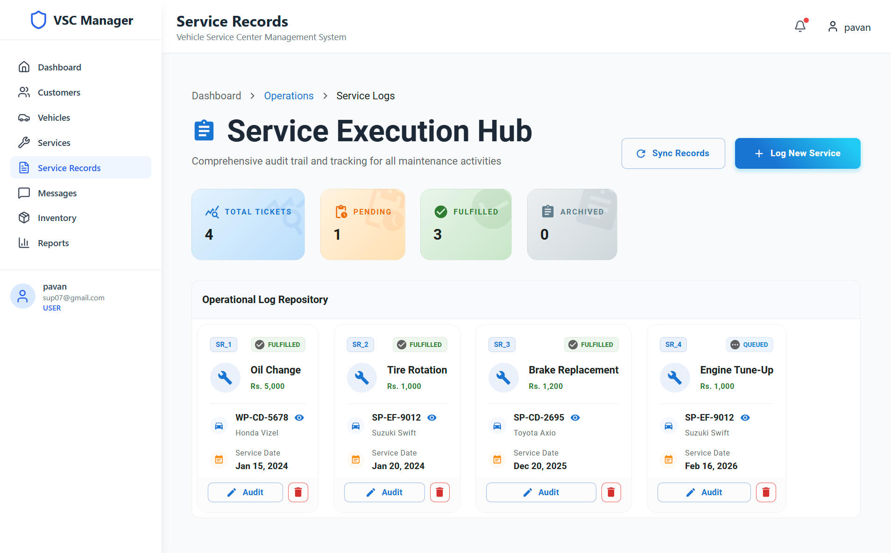
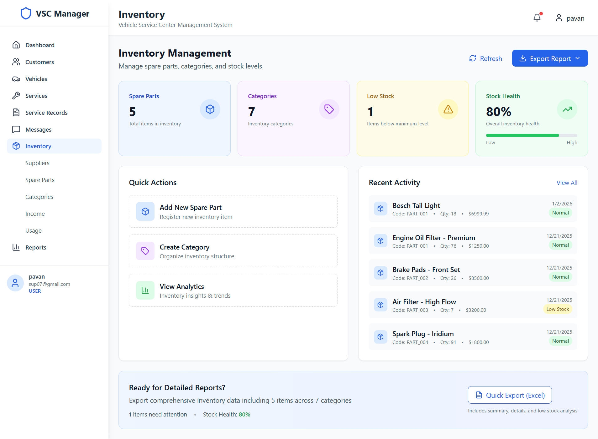

# 🚗 VSC Manager -- Vehicle Service Center Management System

A full-stack web application developed to manage vehicle service center operations efficiently.  
This system handles customer management, vehicle records, service bookings, authentication, reporting, and administrative control.

> 📌 Personal Full-Stack Project  
> 💻 Built using Spring Boot and React

---

# 📖 Table of Contents

- Project Overview
- Tech Stack
- System Features
- System Architecture
- Database Configuration
- Backend Setup
- Frontend Setup
- Authentication & Security
- Reporting & Exporting
- Project Structure
- Future Improvements
- Author

---

# 📌 Project Overview

The Vehicle Service Center Management System is designed to digitalize and automate service center operations.  

It allows administrators and users to:

- Manage vehicles and customer details
- Book and track service appointments
- Generate reports
- Monitor revenue and service statistics
- Maintain secure access using JWT authentication

---

# 🛠️ Tech Stack

## 🔹 Backend

- Spring Boot 3.1.5
- Spring Data JPA (Hibernate)
- Spring Security
- JWT (io.jsonwebtoken 0.11.5)
- MySQL
- Lombok
- Maven
- Java 17

## 🔹 Frontend

- React 19
- Material UI (MUI)
- Tailwind CSS
- Axios
- React Router DOM
- Chart.js
- Recharts
- jsPDF
- xlsx (Excel export)
- React Toastify

### 🛠 Testing Tools
- JUnit 5
- Mockito
- Spring MockMvc
- AssertJ
- H2 Database (Test DB)
  
---


#  System Features

## 🔐 Authentication & Authorization
- JWT-based authentication
- Token expiration (24 hours)
- Secure protected API routes
- Role-based access control (Admin / User)

## 👤 User Management
- User registration & login
- Profile image upload
- Secure password handling

## 🚘 Vehicle Management
- Add, update, delete vehicles
- View service history per vehicle
  
## 📦 Inventory Management
-Add, update, and delete spare parts
-Track available stock quantities
-Automatic stock reduction after service usage
-Low stock monitoring
-View inventory history
-Manage part prices and suppliers
-Real-time stock updates
-Inventory search and filtering

## 📊 Dashboard & Analytics
- visualization
- statistics charts
- Performance overview using charts

## 📄 Report Generation
- PDF report generation using jsPDF
- Excel export using xlsx
- Downloadable reports

## 🌐 API Integration
- RESTful APIs
- CORS configured for frontend integration

---
## 🧪 Testing
- **Unit Tests:** Service layer testing with Mockito
- **Integration Tests:** API endpoint testing with MockMvc
- **Security Tests:** JWT authentication & validation


# 🏗️ System Architecture

Frontend (React)  
⬇ Axios HTTP Requests  
Backend (Spring Boot REST API)  
⬇  
MySQL Database  

Architecture Type:
- REST-based Client-Server Architecture
- Layered Architecture (Controller → Service → Repository → Database)

---

# 🗄️ Database Configuration

Database: MySQL  
Database Name: `vehicle_service_center`

JPA Configuration:
```
spring.jpa.hibernate.ddl-auto=update
spring.jpa.show-sql=true
```

The database tables are automatically generated and updated using Hibernate.

---

# ⚙️ Backend Setup (Spring Boot)

## 🔹 Prerequisites

- Java 17
- Maven
- MySQL

## 🔹 Steps

1️⃣ Navigate to backend folder:

```
cd vehicle-service-backend
```

2️⃣ Configure database in `application.properties`:

```
spring.datasource.url=jdbc:mysql://localhost:3306/vehicle_service_center
spring.datasource.username=your_username
spring.datasource.password=your_password
```

3️⃣ Run the application:

```
mvn spring-boot:run
```

Backend runs on:

```
http://localhost:8080
```

---

# ⚙️ Frontend Setup (React)

## 🔹 Prerequisites

- Node.js (v18+ recommended)
- npm

## 🔹 Steps

1️⃣ Navigate to frontend folder:

```
cd frontend
```

2️⃣ Install dependencies:

```
npm install
```

3️⃣ Start application:

```
npm start
```

Frontend runs on:

```
http://localhost:3000
```
test run:
```bash
cd vehicle-service-backend
mvn clean test
----
---
# 🔐 Authentication & Security

- JWT secret-based token generation
- Token expiration: 86400000 ms (24 hours)
- Protected API endpoints
- Role-based access
- Secure password validation
- CORS configured for:
```
http://localhost:3000
```

---

# 📊 Reporting & Exporting

The system supports:

- 📈 Revenue visualization using Chart.js and Recharts
- 📄 PDF report generation
- 📊 Excel export functionality
- Real-time dashboard data display

---

# 📁 Project Structure


```
vehicle-service-center/
│
├── vehicle-service-backend/
│   ├── controller/
│   ├── service/
│   ├── repository/
│   ├── entity/
│   ├── security/
│   └── config/
│
└── frontend/
    ├── components/
    ├── pages/
    ├── services/
    ├── hooks/
    └── utils/
```


## 📸 Screenshots

### sparepart Page


### Service Record Page


### Inventory Page



# 👩‍💻 Author

Navodya Thilakarathna    
*VSC Manager* - Personal Project – Vehicle Service Center Management System

---

